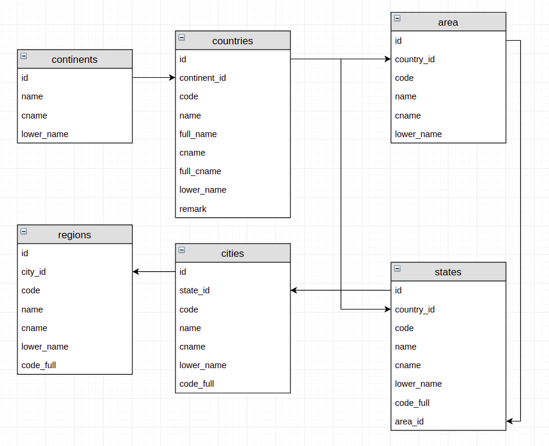

### 公司用到的世界位置信息，把数据整理出来供参考使用。
#### PS：该数据以中文为主，极少数无对应的英文，逐渐补充中。
###### 以前用过的数据都是以英文为主，缺省中文，这次整理的数据以中文为主，极少数缺省英文，哈哈，开心。

#### 提供sql，csv，json格式数据下载，world_area.sql为总的sql文件

#####
该world_area数据分洲，国家，省份（州），区（市），县,美国又分了几大区域，提供中文，英文，编码等相关信息，各级关系链式存储。

##### 具体关系如下图：

